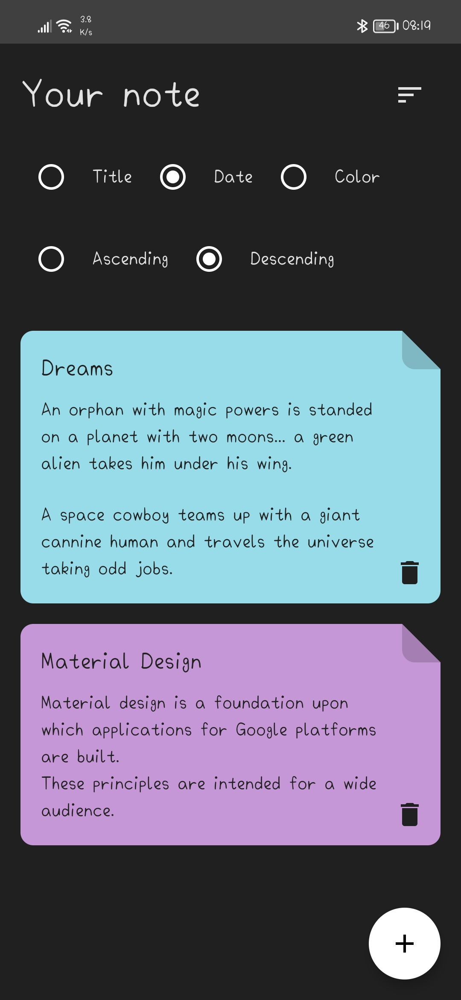

# Notes
* Notes can create and edit documents on mobile or tablet and collaborate with others.

* Try creating a new note.
You can create a new note by tapping + in the bottom right corner of the main screen.

* Every note has its own color.

## Screenshots

  
  

## Downloads
